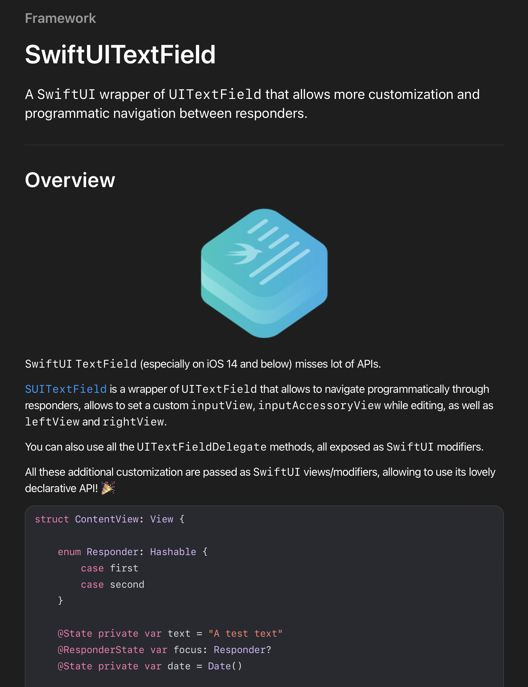

<h1 align="center">
  <br>
  <a href="http://www.amitmerchant.com/electron-markdownify"></a>
  <br>
  SwiftUI Text Field
  <br>
</h1>

<h4 align="center">A SwiftUI wrapper of UITextField that allows more customization</h4>

<p align="center">
  <a href="https://badge.fury.io/js/electron-markdownify">
    
  </a>
  <a href="https://gitter.im/amitmerchant1990/electron-markdownify"></a>
  <a href="https://saythanks.io/to/bullredeyes@gmail.com">
      
  </a>
  <a href="https://www.paypal.me/AmitMerchant">
    
  </a>
</p>

<p align="center">
  <a href="#key-features">Key Features</a> •
  <a href="#how-to-use">How To Use</a> •
  <a href="#download">Download</a> •
  <a href="#credits">Credits</a> •
  <a href="#related">Related</a> •
  <a href="#license">License</a>
  <br><br><br>
  
</p>

## Key Features

* InputView and InputAccessoryView
* LeftView and RightView
* All `UITextFieldDelegate` methods exposed as `SwiftUI` modifiers.
* Programmatic navigation similar to iOS 15 `FocusState`
* DocC documented!

## In short...

Just use it as you would use any other `SwiftUI` view!

```swift
struct ContentView: View {

    enum Responder {
        case first
        case second
    }

    @State private var text = "A test text"
    @ResponderState var focus: Responder?
    @State private var date = Date()

    var body: some View {
        ScrollView {
            VStack {
                SUITextField(text: $text, placeholder: "Insert a text...")
                    .inputAccessoryView {
                        MyAccessoryView() // add an accessory view 
                    }
                    .onReturnKeyPressed {
                        focus = nil // set focus to nil to close keyboard on return key tap
                    }
                    .leftView { // add a left view to clear text on tap
                        Button(action: { text = "" }) {
                            Image(systemName: "trash")
                        }
                        .padding(.horizontal, 2)
                    }
                    .responder($focus, equals: .first)
                    .uiTextFieldTextLeftViewMode(.whileEditing)
                SUITextField(text: .constant(date.description))
                    .inputAccessoryView {
                        MyAccessoryView()
                    }
                    .inputView {
                        // Use a date picker as input view!
                        DatePicker("Select date", selection: $date)
                            .frame(maxWidth: .infinity, maxHeight: .infinity)
                            .datePickerStyle(.wheel)
                            .labelsHidden()
                    }
                    .responder($focus, equals: .second)
            }
            .padding()
        }
        // apply style to all children text field!
        .uiTextFieldBorderStyle(.roundedRect)
    }

    // more code...
```

## Documentation

Use Apple `DocC` generated documentation, from Xcode, `Product > Build Documentation`.



## Known Issues

- When an external keyboard is connected and the software keyboard is hidden, 
on iOS 15 there is small layout jump when switching from a text field with custom input view and one
with normal software keyboard
- On iOS 14 this behavior is worse: sometimes the system tries to re-layout the component infinitely, leading to a
stack overflow and crash! Need to understand what actually happens under the hood...

## Found a bug or want new feature?

If you found a bug, you can open an issue as a bug [here](https://github.com/ricocrescenzio95/SUITextField/issues/new?assignees=ricocrescenzio95&labels=bug&template=bug_report.md&title=%5BBUG%5D)

Want a new feature? Open an issue [here](https://github.com/ricocrescenzio95/SUITextField/issues/new?assignees=ricocrescenzio95&labels=enhancement&template=feature_request.md&title=%5BNEW%5D)

## License

Copyright (c) 2022 Quirico Crescenzio

Permission is hereby granted, free of charge, to any person
obtaining a copy of this software and associated documentation
files (the "Software"), to deal in the Software without
restriction, including without limitation the rights to use,
copy, modify, merge, publish, distribute, sublicense, and/or sell
copies of the Software, and to permit persons to whom the
Software is furnished to do so, subject to the following
conditions:

The above copyright notice and this permission notice shall be
included in all copies or substantial portions of the Software.

THE SOFTWARE IS PROVIDED "AS IS", WITHOUT WARRANTY OF ANY KIND,
EXPRESS OR IMPLIED, INCLUDING BUT NOT LIMITED TO THE WARRANTIES
OF MERCHANTABILITY, FITNESS FOR A PARTICULAR PURPOSE AND
NONINFRINGEMENT. IN NO EVENT SHALL THE AUTHORS OR COPYRIGHT
HOLDERS BE LIABLE FOR ANY CLAIM, DAMAGES OR OTHER LIABILITY,
WHETHER IN AN ACTION OF CONTRACT, TORT OR OTHERWISE, ARISING
FROM, OUT OF OR IN CONNECTION WITH THE SOFTWARE OR THE USE OR
OTHER DEALINGS IN THE SOFTWARE.

---

Thanks Bebisim ❤️ 
